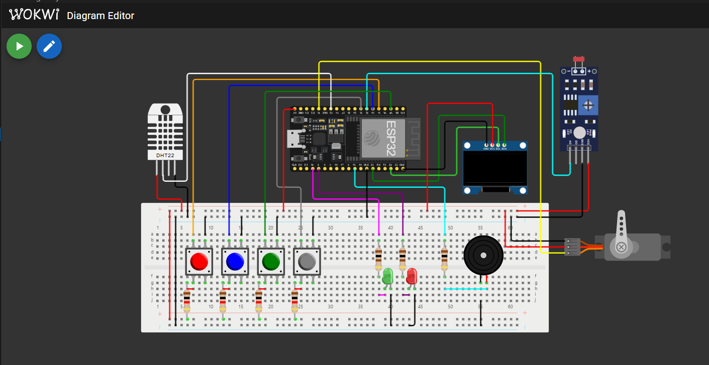

# 💊 Medibox: Smart Medication Reminder and Storage Monitor

This project implements a **smart Medibox** on the ESP32 using the Wokwi simulator. It serves two primary purposes:

1. **Medication Reminder**: Reminds users to take their medicine on time with alarms.
2. **Storage Environment Monitor**: Ensures medicine is stored under ideal temperature, humidity, and light conditions.

---

## 🔧 Features

### 🕒 Alarm & Clock
- Set time zone using UTC offset.
- Fetch current time from an NTP server over Wi-Fi.
- OLED displays the current time.
- Set, view, and delete up to 2 alarms.
- Alarm rings with buzzer/LED when triggered.
- Stop or snooze (5 mins) alarm using a push button.

### 🌡️ Environmental Monitoring
- Monitor temperature and humidity via DHT11.
- Trigger warnings if:
  - Temperature is not between 24–32 °C
  - Humidity is not between 65–80%
- Display alerts on OLED and LED.

### ☀️ Light Intensity Monitoring
- Light intensity measured by an LDR every `ts` seconds.
- Average of light readings sent to Node-RED every `tu` minutes.
- Configurable via Node-RED:
  - Sampling interval (`ts`)
  - Sending interval (`tu`)
- Scaled intensity (0 to 1) shown on dashboard with:
  - Numeric display
  - Historical chart

### 🪟 Shaded Sliding Window (Servo Control)
- Servo motor adjusts between 0°–180° to limit light.
- Controlled based on:
  - Light intensity
  - Temperature
  - Sampling and sending intervals
- Uses the formula:
    θ = θoffset + (180 − θoffset) × I × γ × ln(ts / tu) × (T / Tmed)

- Configurable from Node-RED:
- Minimum angle (θoffset)
- Control factor (γ)
- Ideal temperature (Tmed)

---

## 📟 Node-RED Dashboard

Includes:
- Group: Light Intensity Monitor
- Light chart
- Average value display
- Sliders for `ts`, `tu`
- Group: Shaded Window Settings
- Sliders for θoffset, γ, Tmed

---

## 📸 Screenshots

### 🔌 Wokwi Simulation

### 📊 Node-RED Dashboard

---

---

